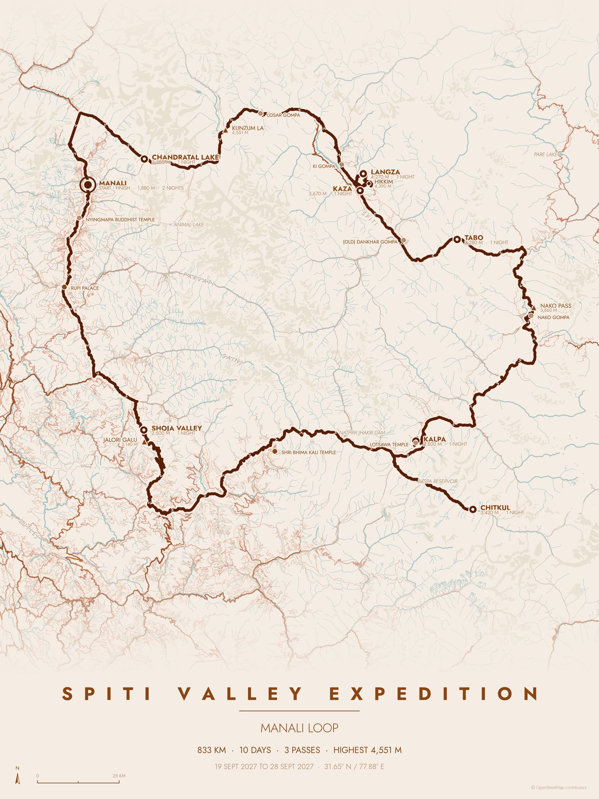
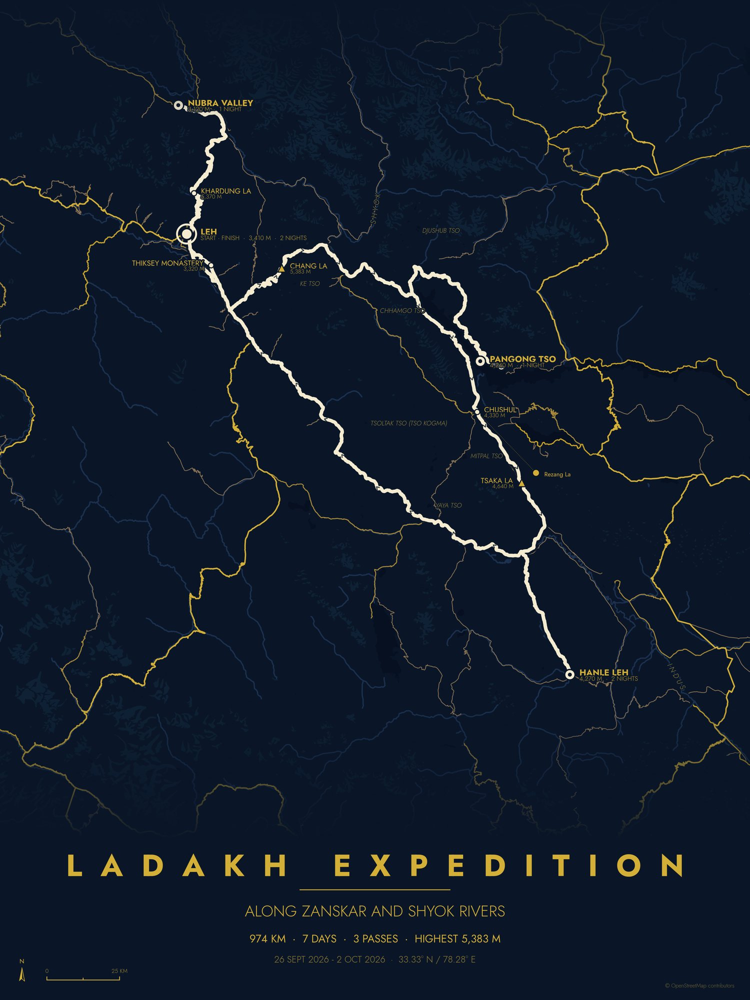

# RouteToPoster

Turn a road trip planned in Google Maps into a minimalist map poster: the region's real roads,
rivers and lakes in one of 17 colour themes, with your route, stops, mountain passes and sights on
top.

You give it one thing, a Google Maps directions link. It writes a trip file you can edit (title,
dates, nights at each stop, theme, size…), and then draws the poster.

Inspired by [maptoposter](https://github.com/originalankur/maptoposter) by Ankur Gupta.

| Spiti Valley (terracotta) | Ladakh (midnight blue) |
|---|---|
|  |  |

## 1. Install (once)

You need Python 3.10 or newer.

```bash
git clone <this repository> routetoposter
cd routetoposter
python3 -m venv .venv
.venv/bin/pip install -e ".[dev]"
```

All commands below are run from the `routetoposter` folder.

## 2. Get the Google Maps link

1. Open Google Maps and plan the trip with **Directions**, adding every stop in order. For a loop,
   add the starting place again as the last stop.
2. Pick each stop **from Google's suggestion list** (don't just type a name and press Enter), so
   the link carries its exact position.
3. Don't drag the blue route line onto other roads (not supported yet).
4. Copy the link from the address bar, or use **Share → Copy link**.

## 3. Create the trip file

```bash
.venv/bin/routetoposter new -o trips/ladakh.yaml
```

It asks you to paste the link: paste it and press Enter. It then:
- reads every stop and its exact position from the link,
- works out the road route and shows the distance and driving time of every leg,
- saves `trips/ladakh.yaml` and prints it.

You can also put the link on the command line, but then wrap it in **single quotes**:
`new 'https://www.google.com/maps/dir/…' -o trips/ladakh.yaml`. Inside double quotes, bash changes
the link's `!` characters and the stop positions are lost.

**Check the leg distances against Google Maps.** A leg marked `⚠` is much longer by road than in a
straight line, which usually means OpenStreetMap is missing a road there (common near borders). If
it's wrong, choose a nearby stop on a main road in Google Maps and make a new trip file.

## 4. Edit the trip file

Open `trips/ladakh.yaml` in any text editor. Every setting has a comment saying what it does. The
ones you'll usually change:

| Setting | What it does |
|---|---|
| `title` | The big title. `new` puts in a placeholder: change it. |
| `subtitle` | `auto` = the places you stayed at; or your own text; `""` = none |
| `dates` | Free text, e.g. `26 Sept – 2 Oct 2026` |
| `nights` (on each stop) | Nights you slept there. Decides the markers and the number of days. |
| `sights_nearby` (on each stop) | Places you saw near that stop, e.g. `[Rezang La, Pangong Lake]` |
| `theme` | One of 17 themes (`routetoposter themes` lists them) |
| `size` | `8x10`, `12x16`, `18x24`, `24x36`, `A4`, `A3`, `A2`, `instagram`, `phone`, `wallpaper` |
| `orientation` | `portrait` or `landscape` |
| `dpi` | `150` screen, `300` print, `600` big print |
| `format` | `png`, `pdf` or `svg` |
| `map_detail` | `auto`, `more` or `less`: how many small roads are drawn |
| `show:` | Switches: stop labels, altitudes, passes, sights, river names, scale bar, arrows, stats line |

A sight in `sights_nearby` can be written three ways:

```yaml
sights_nearby:
  - Key Monastery                                     # found in OpenStreetMap near the stop
  - {name: Key Monastery, kind: monastery}            # also choose its symbol
  - {name: Key Monastery, lat: 32.297, lon: 78.012}   # exact spot (copy it from Google Maps)
```

Local words count as the same (gompa = monastery, tal/tso = lake, mandir = temple, qila = fort…).
If a name can't be found, it tells you and suggests the closest real names.

Set `auto_sights: true` under `show:` to also add well-known monasteries, temples, forts and
viewpoints along the route automatically.

## 5. Check, preview, make

```bash
.venv/bin/routetoposter check trips/ladakh.yaml      # is the file valid? where were my sights found?
.venv/bin/routetoposter preview trips/ladakh.yaml    # quick small image: posters/previews/ladakh_<theme>.png
.venv/bin/routetoposter make trips/ladakh.yaml       # the final poster: posters/ladakh_<theme>_<size>.png
```

- `preview --all-themes` draws every theme plus one sheet with all of them side by side, which is
  handy for choosing a theme.
- Running a command again overwrites its previous image.
- Every theme at several sizes, in final quality:

  ```bash
  .venv/bin/python scripts/all_themes.py trips/ladakh.yaml 12x16 instagram
  ```

**The first run for a new area takes a few minutes**: it downloads the map, passes and altitudes
from OpenStreetMap and other free services. Everything is saved in `cache/`, so later runs (another
theme, size, title or nights) take seconds.

## 6. If something goes wrong

| Message | What to do |
|---|---|
| `positions for 0` or `the part after data= has been changed` | The shell changed the link. Run `new -o …` without the link and paste it when asked, or use single quotes. |
| `… named stops but positions for …` (some, not 0) | A stop was typed instead of picked from Google's suggestions, or the route was dragged. Fix it in Google Maps and copy the link again. |
| `⚠ Couldn't look up mountain passes / '<sight>' …` | OpenStreetMap's server is busy or unreachable. The poster is still made; run it again later to add them. |
| `Couldn't find these sights … did you mean …?` | Use one of the suggested names, fix the spelling, add `lat`/`lon`, or remove the sight. |
| `"titel" isn't a setting. Did you mean "title"?` | A typo in the trip file; the message names the setting. |
| `OpenStreetMap servers are busy or unreachable` while downloading the map | Wait a few minutes and run it again; the parts already downloaded are kept. |

## 7. Examples

`examples/` has three finished trip files (Spiti, Kerala, Ladakh):

```bash
mkdir -p trips && cp examples/spiti.yaml trips/
.venv/bin/routetoposter preview trips/spiti.yaml
```

## Tests

```bash
.venv/bin/pytest
```

The tests never use the network.

## Licence and credits

RouteToPoster is MIT-licensed: see `LICENSE`.

- Map data © [OpenStreetMap](https://www.openstreetmap.org/copyright) contributors (ODbL).
- Themes from [maptoposter](https://github.com/originalankur/maptoposter), MIT licence: see `themes/LICENSE`.
- Font: [Jost](https://github.com/indestructible-type/Jost), SIL Open Font License: see `fonts/jost/OFL.txt`.
- Routing by [OSRM](https://project-osrm.org) and [Valhalla](https://github.com/valhalla/valhalla); altitudes from [Open-Meteo](https://open-meteo.com).
